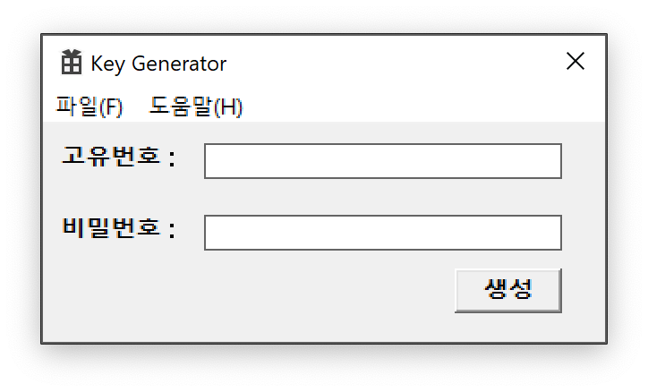
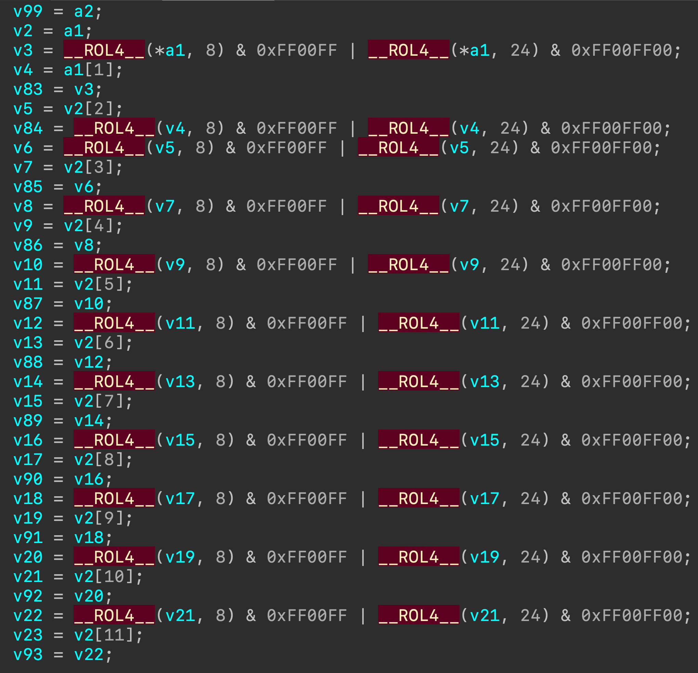
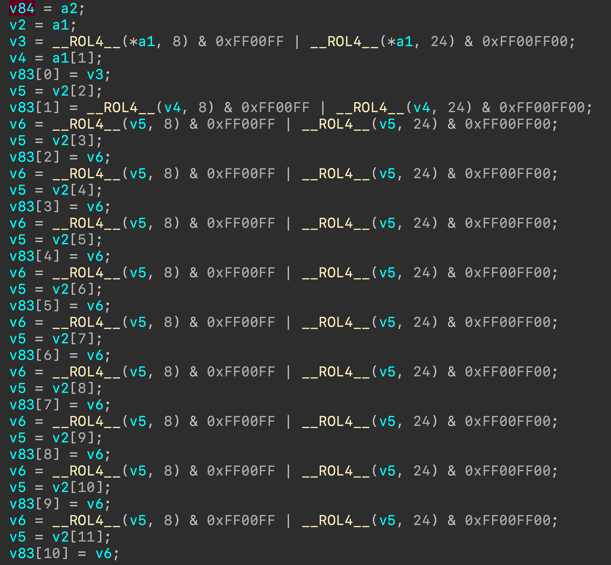
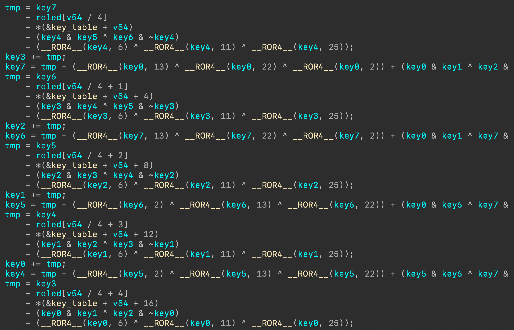

# Basic Info
* amd64 PE file
* Not packed
* x64 Microsoft visual C++ v14
* Windows GUI

> ⚠️ 저도 처음 시도해 보는 것이 매우 많습니다.
> 최대한 자세한 내용을 쓰고자 하나,
> 설명이 부족한 부분이 많으니 이점 양해 부탁 드립니다.



실행하면 위와 같이 나온다.

같이 주어지는 `information.txt` 파일을 확인하면 특정 시각에
고유번호와 비밀번호를 넣어 나오는 값이 `6A30-1099`를 만족해야 하는 것으로 보인다.

> information.txt
```
KST 2020-09-11 오후 8:17:15 6A30-1099
고유 번호 : B1C2-4EA2-....
```

그러면 이제 생성 버튼을 눌렀을 때 어떠한 일이 일어나는지를
리버싱을 통해서 알아보면 된다. => 고난의 시작

# 생성 함수 찾기

## find WinMain
일단 visual c++을 사용한 프로그램이기 때문에,
이에 맞춰서 main함수를 찾아야 한다.

visual c++을 사용한 프로그램에서 메인 함수를 찾는 방법은
[드림핵](https://dreamhack.io/learn/23#5)에 간단히 나와있다.

`start` -> `4번째 점프` -> `.140001960`

이 함수는 WinAPI에서 WinMain이라는 함수라고 불린다.

```c++
int APIENTRY WinMain(HINSTANCE hInstance, HINSTANCE hPrevInstance, LPSTR lpszCmdParam, int nCmdShow)
```

이 함수는 단순히 창을 생성하고 창 제목을 변경하는 등의 역할을 한다.
그 안에 `lpfnWndProc` 라는 메시지 처리 함수를 지정하는 부분이 있다.

## lpfnWndProc
`.140001ea0` 함수에서는 폼을 생성하는 코드, 종료하는 코드도 있는데,
여기서 가장 중요한 생성 함수를 눌렀을 때의 코드가 있다.

```c++
::hWnd = CreateWindowExW(0, L"Edit", &word_140004520, 0x50800000u, 90, 10, 200, 20, hWndParent, 0i64, v7, 0i64);
```
```c++
qword_140006798 = CreateWindowExW(0, L"Edit", &word_140004520, 0x50800000u, 90, 50, 200, 20, hWndParent, 0i64, v9, 0i64);
```
이 두 부분이 입력 폼을 만드는 부분이다.

```c++
CreateWindowExW(0, L"Button", "생성", 0x50000000u, 230, 80, 60, 25, hWndParent, (HMENU)3, v10, 0i64);
```
이 부분은 생성 버튼을 만드는 부분이다.

아래쪽에 a2 == 0x111, a3 == 3 인 곳에 `.140001b90`을 호출하는데
이것이 바로 생성 버튼을 누를 때 실행되는 함수이다.

다음 단계로 넘어가기 전에 자동으로 변수명이 지정된
`hWnd`는 `goyu_edit`으로, qword_140006798은 `bimil_edit`으로 바꿔준다.

# 생성 함수 분석

## 제한 (invalid format이 뜨지 않게)

그래프를 보면 대충 감이 오겠지만, 안쪽에서 분기문 조건에 안 맞거나
break이 이루어지면 invalid format이 뜬다.

그래서 조건을 몇개 보면 다음과 같다.

### 고유번호 길이
```c++
if ( GetWindowTextLengthA(goyu_edit) == 14 )
```
고유번호의 길이는 information.txt에서 봤듯이 14자리여야한다

### 고유번호 포맷 (대쉬)
```c++
if ( v4[4] == 45 && v4[9] == 45 )
```
5번째와 10번째 글자는 45(-)여야한다.

### 고유번호 포맷 (16진수)
```c++
if ( v8 != 4 && v8 != 9 )
{
    v9 = v4[v8];
    if ( (unsigned __int8)(v9 - 48) > 9u && (unsigned __int8)(v9 - 65) > 5u )
        break;
}
```
숫자가 이거나 A~F중 하나여야한다.

## 흐름 분석

### 초기화
```c++
v1 = hWnd;
v24 = 1779033703;
v2 = 0i64;
v32 = 0;
v25 = -1150833019;
v26 = 1013904242;
v27 = -1521486534;
v28 = 1359893119;
v29 = -1694144372;
v30 = 528734635;
v31 = 1541459225i64;
```
각종 값들을 설정하는 단계이다.
이 숫자들은 나중에 쓰인다.

### 글자 가져오기
```c++
v4 = (CHAR *)sub_1400021E4(0x10ui64);
GetWindowTextA(goyu_edit, v4, 15);
v5 = GetWindowTextLengthA(bimil_edit);
v6 = sub_1400021E4((signed int)(v5 + 2));
GetWindowTextA(bimil_edit, (LPSTR)v6, v5 + 1);
HIDWORD(v31) += v5 >> 29;
v32 += 8 * v5;
```
폼에서 문자열을 가져오는 부분이다.
`.1400021e4`는 들어가보면 size를 받는 것으로 보아, `malloc`함수이다.
(_malloc으로 이름을 바꿔주자)

밑에 두줄은 비밀번호 길이를 가지고 무언가를 설정하고 있다.

### ???
```c++
if ( v5 >= 0x40 ) {
    v7 = (unsigned __int64)v5 >> 6;
    do {
        Dst = *(_OWORD *)v6;
        v34 = *(_OWORD *)(v6 + 16);
        v35 = *(_OWORD *)(v6 + 32);
        v36 = *(_OWORD *)(v6 + 48);
        sub_140001000(&Dst, &v24);
        v6 += 64i64;
        v5 -= 64;
        --v7;
    } while ( v7 );
}
```

비밀번호 길이가 0x40이 넘으면 뭔가 이상한 함수를 실행시킨다.
하지만 실제 프로그램에서는 0x40이상 입력할 수가 없게 되어있다.

지금은 이 부분을 넘기지만 나중에 `.140001000` 함수를 분석해야한다.

### 스택으로
```c++
memcpy(&Dst, (const void *)v6, v5);
```
비밀번호를 스택에 있는 Dst에 저장한다.

---

여기 아래 부분은 실제로 생성하는 코드이다.

---

### 크게 크게 나누기

여러 줄이 있지만 사실 앞부분 토큰을 구하는 로직과 뒷부분 토큰을 구하는 로직이 분리 되어있다.

`.140001760`을 호출 하기 전, 그리고 `malloc`을 호출하기 전 이렇게
세 부분으로 나눠볼 수 있다.

첫번째 부분은 현재 시각을 가지고 이것저것 하는 것 처럼 보이고
두번째 부분은 xmm레지스터를 이용한 연산으로 보이고
세번째 부분은 첫번째 두번째에서 만든 것을 합치는 것이라고 보면 된다.

지금 여기서 보이는 두개 함수에 이름을 붙여줄 수 있다.

* `.140001900` -> sscanf
* `.1400018a0` -> sprintf


## 세번째 부분
세번째 부분을 먼저 보고 나머지를 분석하는게 도움이 될 것이다.

```c++
v3 = (char *)malloc(0xAui64);
v20 = (unsigned int)v11;
v21 = v10 & 0x100;
v22 = (unsigned int)v19;
if ( !v21 )
    v22 = (unsigned int)v20;
if ( !v21 )
    v20 = (unsigned int)v19;
sprintf(v3, "%04hX-%04hX", v20, v22);
```

첫번째 두번째 부분에서 만들어진 v10, v11과 v19라는 변수를 가지고 만드는데,
`v10 & 0x100`을 한 결과가 0이면 `{두번째 hex}-{첫번째 hex}` 꼴이 되고
0이 아니면 `{첫번째 hex}-{두번째 hex}`꼴이 된다.

## 첫번째 부분

> [Doc](https://docs.microsoft.com/en-us/windows/win32/api/sysinfoapi/nf-sysinfoapi-getsystemtimeasfiletime)
<- 한번 읽고 오는 것도?

FILETIME 구조체 포인터를 받아서 현재 시스템 시간을 넣어준다는 그 소리

```c++
sscanf(v4, "%hx-%hx-%hx", &v37, &v38, &v39);
GetSystemTimeAsFileTime(&SystemTimeAsFileTime);
v10 = (*&SystemTimeAsFileTime - 116444736000000000i64) / 6000000000i64;
v11 = v39 ^ v38 ^ v37 * (unsigned __int8)v10;
```

딱 봐도 수를 계산하는게 복잡해 보인다.

그래서 똑같은 코드를 직접 visual c++로 만들어서 돌려보았다.

```c++
#include <windows.h>
#include <stdio.h>

int main(void) {
	FILETIME a;
	GetSystemTimeAsFileTime(&a);
	long long b = *((long long*)&a);
	b = (b - 116444736000000000l) / 6000000000l;
	printf("%lld\n", b);
}
```
컴퓨터 시각을 문제에서 나온 `2020-09-11 20:17:15+0900`으로 맞춰놓고 돌리니 `2666371`이 나왔다.

고유 번호 일부분이 주어지고 시각을 아니깐
주어진 바이너리에서 v37, v38, v10의 값은 아는 상태이다.

이때 `v10 & 0x100`은 0이 아니므로 결과값인 v11도 0x6a30이 되어야 함을 알고 있다.

xor 역 연산을 하면 다음과 같은 코드로 구할 수 있다.

```python
tttt = 2666371
goyu = [0xb1c2, 0x4ea2]
print(hex(((goyu[1] ^ goyu[0] * (tttt & 0xff)) ^ 0x6a30) & 0xffff))
```

세번째 고유번호는 D2D4임을 알 수 있다.

> [고유번호 얻는 코드](getgoyu.py)

## 두번째 부분

고유번호를 이리저리 바꾸고 컴퓨터 시각도 이리저리 바꿔본 결과,
두번째 부분은 비밀번호에 의해서만 결정된다는 것을 미리 알아냈다.

### `.140001760` 함수 인자
저 함수에 인자로 &v24와 &v40을 넘겨주는데,
v24는 아까 처음에 초기화를 할 때 들어갔던 변수 중 하나이다.

함수 내에서 `v4 = (*(a1 + 36) >> 3) & 0x3F;` 이렇게 사용된 것을 보아,
이 부분은 변수로 해석해도 된다.

변수 선언 부분을 보면 v24 ~ v32까지 int가 10개 들어간다.
v24를 누르고 y키를 누르면 변수 타입을 바꿀 수 있는데,
`int v24[10]`으로 바꿔준다.

&v32는 아래 xmm 레지스터를 이용한 연산을 수행하는데 사용된다.
근데 접근 하는 방법이 배열과 같으니 이 또한 배열로 바꾸어준다.

v32 아래 v33은 이미 배열로 되어있는데
xmm레지스터를 쓸 때 사용하고 있으니 상관하지 않고 `__int64 v32[4]`로 바꾸어준다.

그리고 편의상 v24는 key라는 이름으로 부를 것이다.

### `.140001760` 함수 내부
void로 바꿔주고, 매개변수를 포인터(int*, __int64*)로 바꾸어준다.

`(int *key, __int64 *result)`
이렇게 바꾸었다.

`key[9]`는 호출하기 전에 비밀번호 길이에 8을 곱한 수이다.

```c++
v2 = key;
v3 = result;
v4 = (key[9] >> 3) & 0x3F;
*(key + v4 + 40) = 0x80u;
v5 = v4 + 1;
v6 = key + v5 + 40;
```

v3는 아래쪽에서 마지막에 대입을 할 때 쓰이는데,
인덱스가 4씩 증가하니깐 (int *)라고 생각하면 된다.
`int *_result`라고 변수형과 이름을 바꾸었다.

v4에 비밀번호 길이가 그대로 들어간다고 생각하면 되고
(많이도 비밀 길이가 50자리는 넘지 않으니깐)

그 다음줄은 아래와 같이 해석할 수 있다.
`*(&key[10] + v4) = 0x80` -> 문자열 끝을 널로 채우는 듯이 \x80을 넣는다.

key[10]은 generate 함수에서 Dst 변수이다.

Dst도 보면 __int128이 네개 연달아 있으니 배열로 묶어도 될 것 같다.

그 아래 길이가 0x38보다 작다면 (확실히 작을 수 밖에 없다)
나머지 부분을 null(\x00)로 채운다.

### What is `__ROL4__`?
이 부분이 이번 바이너리에서 굉장히 많이 나오는 식이다.

```c++
__ROL4__(v, 8) & 0xFF00FF | __ROL4__(v, 24) & 0xFF00FF00
```

이 부분은 사실 32bit에서 `빅엔디언 ↔ 리틀엔디언`과 같은 변환을 하는 과정이다.

```
v = 0xAABBCCDD
__ROL4__(v, 8) == 0xBBCCDDAA
__ROL4__(v, 8) & 0x00FF00FF == 0x00CC00AA
__ROL4__(v, 24) == 0xDDAABBCC
__ROL4__(v, 24) & 0xFF00FF00 == 0xDD00BB00
__ROL4__(v, 8) & 0xFF00FF | __ROL4__(v, 24) & 0xFF00FF00 == 0xDDCCBBAA
```


### `.140001000` 함수 인자
> 이 함수는 문제를 풀 때 `stange`라고 이름을 지어 놨던 함수이다.
> 그 만큼 이상하다.

패스워드의 길이를 바꿔서 키의 뒷부분에 집어넣어주고,
문자열이 들어가 있는 (generate 함수에서 Dst배열) 곳 끝에도 넣어준다.

인자로는 문자열과 키 배열을 넘겨준다.

### `strange`
들어가면 v100 까지 있다.

당황하지 않고 ida에서 mat to another variable기능을 활용하면 변수 개수를 아주 많이 줄일 수 있다.

v5, v7, v9, v11 ... 에 마우스를 올려보면 전부다 eax 레지스터이다.

이처럼 똑같은 레지스터를 쓰면서 반복적인 것들은 전부 = 키를 눌러서 같은 것으로 바꿔주면 된다.

그리고 v83 ~ v98을 배열로 묶어준다.



이랬던게



이렇게!

v83을 rol 된거라해서 roled라고 이름을 지었다.

그 밑에는 v33을 기준으로 또 ROR을 수행하는데,

일반화 해서 아래와 같이 정리해준다.

```
roled[a + 16]
    = roled[a]
    + ((roled[a + 1] >> 3) ^ ROR4(roled[a + 1], 7) ^ ROR4(roled[a + 1], 18))
    + roled[a + 9]
    + ((roled[a + 14] >> 10) ^ ROR4(roled[a + 14], 17) ^ ROR4(roled[a + 14], 19))
```

밑에 있는 v46~v53에 값을 대입하는 부분은 key0~7이라 불렀다.

여기에는 인자로 넘겨주었던 키 값이 대입된다.
이 키값은 처음에 초기화 했던 키 값과 똑같다.

아래쪽에 unk_140043d0은 어떤 테이블의 역할을 한다. key_table이라고 부를 것이다.

그래도 v57같은 것이 등장하는데, 이 부분은 전에 봤던 것 처럼
map to another variable을 이용해서 같은 레지스터를 사용한다면 같은 변수로 바꾼다.

다시 풀면서 조금 돌아갔는데, 변수 리턴을 void로 바꾸어주면 잘 나온다.



이런 느낌으로

일반화 시키면 아래와 같다.
```
tmp = key[7-a]
    + roled[a]
    + key_table[a]
    + (key[4-a] & key[5-a] ^ key[6-a] & ~key[4-a])
    + ROR4(key[4-a], 6) ^ ROR4(key[4-a], 11) ^ ROR4(key[4-a], 25)
key[3-a] += tmp
key[7-a] = tmp
    + ROR4(key[-a], 13) ^ ROR4(key[-a], 22) ^ ROR4(key[-a], 2)
    + (key[-a] & key[1-a] ^ key[2-a] & (key[-a] ^ key[1-a]))
```
다만, 키가 앞부분에서 조금 엇갈린다.

이 부분은 예외 처리를 해주는 게 나을 것 같다.

함수 마지막에는 원래 키 값에 새로 만든 키 값을 더한다.

### `.140001760` 정리
_result에다가 strange 함수에서 나온 key값을 역으로 넣어준다.

### 다시 generate 함수
v29에 결과가 저장되어있다.

여기서 hex-ray가 xmm을 위한 어셈블리 명령어를 amd64 내장함수로 바꾼다.

자세한 내용은
[여기](https://software.intel.com/sites/landingpage/IntrinsicsGuide)나
[여기](https://docs.microsoft.com/ko-kr/cpp/intrinsics/x64-amd64-intrinsics-list?view=vs-2019)에서
볼 수 있다.

* _mm_loadl_epi64(MOVQ): __int128을 xmm레지스터로 옮긴다.
* _mm_unpacklo_epi8(PUNPCKLBW): 끼워넣는,,, 그런거다. 다음 이미지를 참고

* _mm_add_epi16(PADDW): 말 그대로 더하는 거
* _mm_srli_si128(PSRLDQ): 8byte 단위로 쉬프트 연산을 수행한다.
* _mm_cvtsi128_si32(MOVD): __int16을 xmm레지스터에서 옮긴다.

결국 동적 디버깅을 해보거나, 자세히 분석해보면
받아온 키 8개를 16bit 단위로 다 더하는 것이라고 보면 된다.

# z3 code

[비밀번호](getbimil.py)

z3코드를 짤 때 어려웠던 점이,
z3는 기본적으로 `>>`또는 `<<` 을 사용하면
산술 쉬프트를 사용해서 어셈블리 명령어로 shr, shl과는 맞지 않다.

그래서 LShR을 사용해야 제대로 나온다.